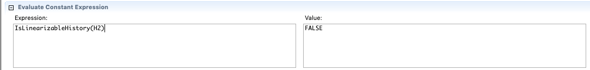
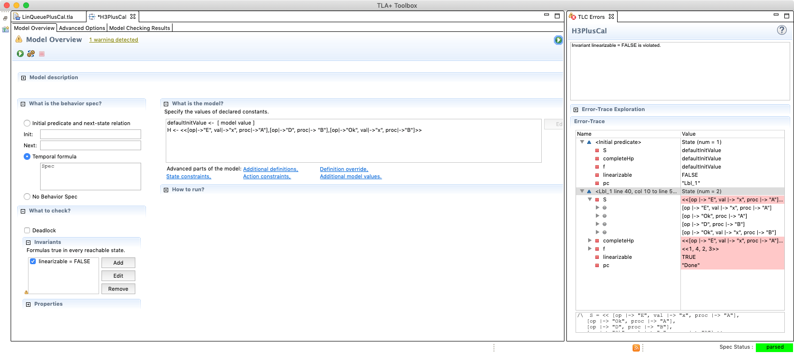

# Reading the Herlihy & Wing Linearizability paper with TLA+

This repository contains a TLA+ model for checking if an object history is
linearizable. 

The [Herlihy & Wing 1990](http://dx.doi.org/10.1145/78969.78972) paper entitled
*Linearizability: a correctness condition for concurrent objects*
introduced *linearizability* as a correctness condition for reasoning about the
behavior of concurrent data structures.

Peter Bailis's blog entry [Linearizability versus Serializability][bailis-lin]
has a good definition:

> Linearizability is a guarantee about single operations on single objects. It
> provides a real-time (i.e., wall-clock) guarantee on the behavior of a set of
> single operations (often reads and writes) on a single object (e.g.,
> distributed register or data item).

> In plain English, under linearizability, writes should appear to be
> instantaneous. Imprecisely, once a write completes, all later reads (where
> “later” is defined by wall-clock start time) should return the value of that
> write or the value of a later write. Once a read returns a particular value,
> all later reads should return that value or the value of a later write.

[bailis-lin]: http://www.bailis.org/blog/linearizability-versus-serializability/

There are several linearizable data stores whose behavior has been specified
with [TLA+]:

* Lamport's book [Specifying Systems][specifying-systems] uses an example of a linearizable memory in
Section 5.3.
* The [Raft][raft] Consensus algorithm supports linearizable semantics and has a
  [TLA+ specification][raft-tla].
* [Azure Cosmos DB][cosmosdb] supports a consistency model with linearizable reads and has 
  [high-level TLA+ specifications][cosmosdb-tla].
  

[TLA+]: https://lamport.azurewebsites.net/tla/tla.html
[specifying-systems]: https://lamport.azurewebsites.net/tla/book.html
[raft]: https://raft.github.io/
[raft-tla]: https://github.com/ongardie/raft.tla
[cosmosdb]: http://cosmosdb.com/
[cosmosdb-tla]: https://github.com/Azure/azure-cosmos-tla

However, none of these models use the definition of linearizability outlined in
the original paper by Herlihy & Wing.

Indeed, the definition in the original paper is awkward to use with TLC (the
TLA+ model checker), because it involves reordering of event histories, which
leads to state space explosion.

However, I found it useful to work directly with the definition of
linearizability as an exercise for practicing with TLA+, as well as to gain a
better understanding of how linearizability is defined.

## Files in this repository

* [Linearizability.tla](Linearizability.tla) contains a definition of
  linearizability. In particular, the `IsLinearizableHistory` operator
  returns true if an event history is linearizable.
* [LinQueue.tla](LinQueue.tla) instantiates the Linearizability module for
  a queue (FIFO) object. It contains an `IsLinearizableHistory` operator that returns true
  if an event history for a queue is linearizable.
* [LinQueuePlusCal.tla](LinQueuePlusCal.tla) is a PlusCal version. If a
  history is linearizable, using TLC with this module makes it easy to see
  a valid linearization.
* [Utilities.tla](Utilities.tla) conatins some general-purpose operators.

## Histories

On p469, the paper defines a *linearizable object* as an object whose concurrent
histories are linearizable with respect to some sequential specification.

To understand linearizability, we need to understand what a concurrent history
is.

As a motivating example, figure one from the paper shows several possible
histories for a concurrently accessed queue.  Figures 1(a) and 1(c) are
linearizable, and Figures 1(b) and 1(d) are not.


Each interval represents an operation. There are two types of operations: {E,
D} for enqueue and dequeue. There are three processes: {A, B, C}. There are three
items that can be added to the queue: {x, y, z}.

Here's how I modeled these four histories in TLA+:

```
H1 == <<
        [op|->"E", val|->"x", proc|->"A"],
        [op|->"E", val|->"y", proc|->"B"],
        [op|->"Ok", proc|->"B"],
        [op|->"Ok", proc|->"A"],
        [op|->"D",  proc|->"B"],
        [op|->"Ok", val|->"x", proc|->"B"],
        [op|->"D",  proc|->"A"],
        [op|->"Ok", val|->"y", proc|->"A"],
        [op|->"E", val|->"z", proc|->"A"]>>

H2 == <<
        [op|->"E", val|->"x", proc|->"A"],
        [op|->"Ok", proc|->"A"],
        [op|->"E", val|->"y", proc|->"B"],
        [op|->"D",  proc|->"A"],
        [op|->"Ok", proc|->"B"],
        [op|->"Ok", val|->"y", proc|->"A"]
>>

H3 == <<
        [op|->"E", val|->"x", proc|->"A"],
        [op|->"D", proc|-> "B"],
        [op|->"Ok", val|->"x", proc|->"B"]>>


H4 == <<
        [op|->"E", val|->"x", proc|->"A"],
        [op|->"E", val|->"y", proc|->"B"],
        [op|->"Ok", proc|->"A"],
        [op|->"Ok", proc|->"B"],
        [op|->"D", proc|-> "A"],
        [op|->"D", proc|-> "C"],
        [op|->"Ok", val|->"y", proc|->"A"],
        [op|->"Ok", val|->"y", proc|->"C"]
>>
```

We can use the `IsLinearizableHistory` operator from LinQueue.tla to verify that
H2 is not linearizable.



For H3, we can use the `FindLinearization` algorithm for LinQueuePlusCal to
find a linearization. We specify `linearizable = FALSE` as the invariant and
run the model checker. The variable `S` contains the linearization:



```
<<
    [op|->"E", val|->"x", proc|->"A"],
    [op|->"Ok", proc|->"A"],
    [op|->"D", proc|-> "B"],
    [op|->"Ok", val|->"x", proc|->"B"]
>>
```

## Some excerpts of the model

I endeavored to make the TLA+ representation as close as possible to how the
definitions were written in the paper, rather than trying to optimize for
reducing the state space of the TLC model checker.

### Linearizable history

p469:

A history H is linearizable if it can be extended (by appending zero or more
response events) to some history H’ such that:

* L1: complete(H’) is equivalent to some legal sequential history S, and
* L2: <<sub>H</sub> ⊆ <<sub>S</sub>


Here's how I modeled this in TLA+:

```
IsLinearizableHistory(H) == 
    \E Hp \in ExtendedHistories(H) : 
       LET completeHp == Complete(Hp)
       IN \E f \in Orderings(Len(completeHp)) :
            LET S == completeHp ** f            
            IN /\ IsSequential(S)               \* L1
               /\ IsLegal(S)                    \* L1
               /\ AreEquivalent(S, completeHp)  \* L1
               /\ RespectsPrecedenceOrdering(H, S) \* L2
```

### complete(H)

From p467:

If H is a history, complete(H) is the maximal subsequence of H consisting only of invocations and matching responses.

A subsequence is a sequence that can be derived from another sequence by
deleting some or no elements without changing the order of the remaining
elements (source: [Wikipedia](https://en.wikipedia.org/wiki/Subsequence))

```
Complete(H) ==
    LET subseqs == Subsequences(H)
    IN CHOOSE CH \in subseqs :
        /\ OnlyInvAndMatchingResponses(CH) 
        /\ \A s \in subseqs : OnlyInvAndMatchingResponses(s) => Len(s) <= Len(CH) \* maximal
```

### Sequential

p467

A history H is sequential if:
1. The first event of H is an invocation.
2. Each invocation, except possibly the last, is immediately followed by a
   matching response. Each response is immediately followed by a matching
   invocation.

```
IsSequential(H) ==
    LET IsLastInvocation(h,i) == \A j \in 1..Len(h) : IsInvocation(h[j]) => j<=i
    IN /\ Len(H)>0 => IsInvocation(H[1])
       /\ \A i \in 1..Len(H) : IsInvocation(H[i]) => (IsLastInvocation(H,i) \/ Matches(H, i, i+1))
       /\ \A i \in 1..Len(H) : IsResponse(H[i]) => Matches(H,i-1,i)
```

### Legal sequential history

The specificiation for a legal sequential history varies based on the kind of
object whose behavior you are trying to model. The paper uses a queue (FIFO) as the example object being
modeled.

Most of the work is done by the recursive `LegalQueue` function.

```
RECURSIVE LegalQueue(_, _)

\* Check if a history h is legal given an initial queue state q
LegalQueue(h, q) == \/ h = << >>
                    \/ LET first == Head(h)
                           rest == Tail(h)
                       IN \/ /\ first.op = "E" 
                             /\ LegalQueue(rest, Append(q, first.val))
                          \/ /\ first.op = "D"
                             /\ Len(q)>0
                             /\ first.val = Head(q)
                             /\ LegalQueue(rest, Tail(q))

IsLegalQueueHistory(h) == LegalQueue(h, << >>)

\* Given a sequential history H, true if it represents a legal queue history
IsLegal(H) == 
    LET RECURSIVE Helper(_, _)
        Helper(h, s) == IF h = << >> THEN IsLegalQueueHistory(s)
                        ELSE LET hr == Tail(Tail(h))
                                 inv == h[1]
                                 res == h[2]
                                 e == [op|->inv.op, val|-> IF inv.op = "E" THEN inv.val ELSE res.val]
                             IN Helper(hr, Append(s, e))
    IN Helper(H, <<>>)
```
