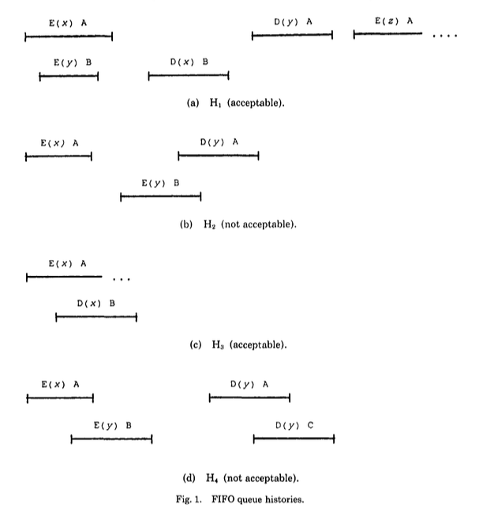

# Reading the Herlihy & Wing Linearizability paper with TLA+

The [Herlihy & Wing 1990](http://dx.doi.org/10.1145/78969.78972) paper entitled
*Linearizability: a correctness condition for concurrent objects*
introduced *linearizability* as a correctness condition for reasoning about the
behavior of concurrent data structures.

Peter Bailis's blog entry [Linearizability versus Serializability][bailis-lin]
has a good definition:

> Linearizability is a guarantee about single operations on single objects. It
> provides a real-time (i.e., wall-clock) guarantee on the behavior of a set of
> single operations (often reads and writes) on a single object (e.g.,
> distributed register or data item).

> In plain English, under linearizability, writes should appear to be
> instantaneous. Imprecisely, once a write completes, all later reads (where
> “later” is defined by wall-clock start time) should return the value of that
> write or the value of a later write. Once a read returns a particular value,
> all later reads should return that value or the value of a later write.

[bailis-lin]: http://www.bailis.org/blog/linearizability-versus-serializability/

There are several linearizable data stores whose behavior has been specified
with [TLA+]:

* Lamport's book [Specifying Systems][specifying-systems] uses an example of a linearizable memory in
Section 5.3.
* The [Raft][raft] Consensus algorithm supports linearizable semantics and has a
  [TLA+ specification][raft-tla].
* [Azure Cosmos DB][cosmosdb] supports a consistency model with linearizable reads and has 
  [high-level TLA+ specifications][cosmosdb-tla].
  

[TLA+]: https://lamport.azurewebsites.net/tla/tla.html
[specifying-systems]: https://lamport.azurewebsites.net/tla/book.html
[raft]: https://raft.github.io/
[raft-tla]: https://github.com/ongardie/raft.tla
[cosmosdb]: http://cosmosdb.com/
[cosmosdb-tla]: https://github.com/Azure/azure-cosmos-tla

However, none of these models use the definition of linearizability outlined in
the original paper by Herlihy & Wing.

Indeed, the definition in the original paper is awkward to use with TLC (the
TLA+ model checker), because of state space explosion. However, as an exercise
in becoming more familiar with both the definition of linearizability and with
modeling in TLA+, this repository caontains a definiton of linearizability from the
original paper into a TLA+ model. 

## Files in this repository

* [Linearizability.tla](Linearizability.tla) contains a definition of
  linearizability. In particular, the `IsLinearizableHistory` operator
  returns true if an event history is linearizable.
* [LinQueue.tla](LinQueue.tla) instantiates the Linearizability module for
  a queue (FIFO) object. It contains an `IsLin` operator that returns true
  if an event history for a queue is linearizable.
* [LinQueuePlusCal.tla](LinQueuePlusCal.tla) is a PlusCal version. 

## Figure 1

Figure one shows several possible histories for a concurrently accessed queue.
Figures 1(a) and 1(c) are linearizable, and Figures 1(b) and 1(d) are not.

Each interval represents an operation. There are two types of operations: {E,
D} for enqueue and dequeue. There are three processes: {A, B, C}. There are three
items that can be added to the queue: {x, y, z}.

## Definition of linearizability

The definitions are on p469 of the paper.

### Linearizable object

A *linearizable object* is one whose concurrent histories are linearizable with
respect to some sequential specification.

### Linearizable history

A history H is linearizable if it can be extended (by appending zero or more
response events) to some history H’ such that:

* L1: complete(H’) is equivalent to some legal sequential history S, and
* L2: <H ⊆ <S

